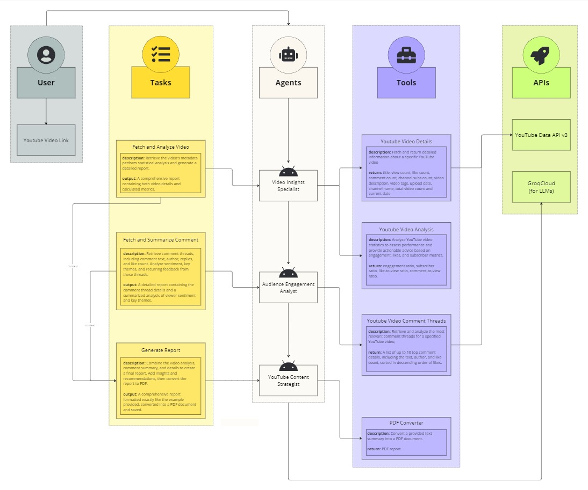

# YouTube Video Inspector

YouTube Video Inspector is a multi-agent-based project that provides basic analysis of YouTube videos. It fetches video statistics, analyzes comments, generates detailed reports, and converts them to PDF format.

<video controls src="assets/youtube-video-inspector.mp4"></video>


https://github.com/user-attachments/assets/bb9aeb3c-1166-4b66-97ad-aa86bd3dcec3


1. Enter a YouTube video URL in the provided input field.
2. Select an LLM model from the dropdown menu.
3. Click "Analyze Video" to start the analysis process.
4. The app will fetch video details, analyze comments, and generate a basic report.
5. Once complete, you can view the analysis results and download the [PDF report](output/Youtube_Video_Analysis_Report.pdf).

## Features

- Fetch and analyze YouTube video metadata
- Analyze video comments and viewer sentiment
- Generate detailed reports on video performance and audience engagement
- Convert reports to PDF format

## Installation
#### Using Docker

The easiest way to run YouTube Video Inspector is using Docker. Pull the latest image from Docker Hub:

```bash
docker pull emirhnslspr/youtube-video-analyzer:v0.1
```

#### Manual Installation
    
1. Clone the Repository:
    ```bash
    git clone https://github.com/emirhansilsupur/youtube-video-analyzer.git
    ```
2. Install Poetry:
    ```bash
   pip install poetry
   ```
3. Install dependencies:
    ```bash
   poetry install
   ```   
3. Run the Streamlit app:
    ```bash
   streamlit run app.py
   ```      

## Configuration   
Create a .env file in the project root and add your API keys:

```
GROQ_API_KEY=your_groq_api_key
YOUTUBE_API_KEY=your_youtube_api_key
```

**Note :** You will need to replace **your_groq_api_key** and **your_youtube_api_key** with your own API keys. You can obtain these keys by signing up for the respective services:

- Groq API Key: Sign up for a [Groq](https://console.groq.com/keys) account and generate an API key.
- YouTube API Key: Follow the [YouTube Data API v3](https://developers.google.com/youtube/v3/getting-started) documentation to create a project and obtain an API key.

## Usage

```bash
docker run -p 8501:8501 -v $(pwd)/output:/app/output --env-file .env emirhnslspr/youtube-video-analyzer:v0.1
```
## Workflow



[Click for the interactive flowchart version.](https://miro.com/app/board/uXjVKjutOC8=/?share_link_id=151983055691)


## License

This project is licensed under the MIT License - see the [LICENSE](./LICENSE) file for details.
